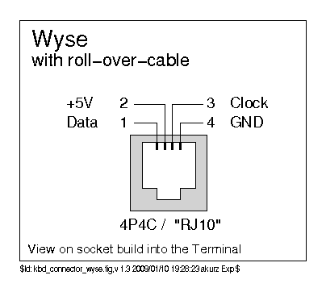

# Wyse Converter

This project is merely a helper to make Wyse converter building more accessible. The person behind the firmware is [Soarer](https://geekhack.org/index.php?action=profile;u=4274), and is solely responsible for making this work. Thank you so much !

Meant to work with Soarer's Wyseverter, documented [in this GeekHack post](https://geekhack.org/index.php?topic=52597.0)

## Assembly
For assembling this converter:  
* 1x Converter pcb
* 1x Arduino Pro Micro clone (Mini OR Micro-usb, PCB supports both)
* 1x RJ9 PCB-mount connector such as [this one](https://www.aliexpress.com/item/1974919975.html?spm=a2g0s.9042311.0.0.3ab54c4dBx8Llu)

It is recommended to socket the Pro Micro controller by using [hotswap sockets](http://www.40percent.club/2018/03/sockets.html), there's plenty to choose from.

Solder the pro micro COMPONENTS AND USB PORT FACING DOWN on to the pcb, and then solder the 4P4C connector.

Flash the firmware using avrdude or QMK Toolbox and you're good to go !

## Case

Currently WIP, will be uploaded into this repo once completed !

## Connector pinout

